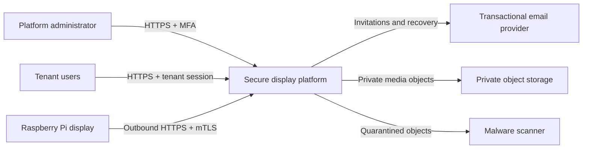
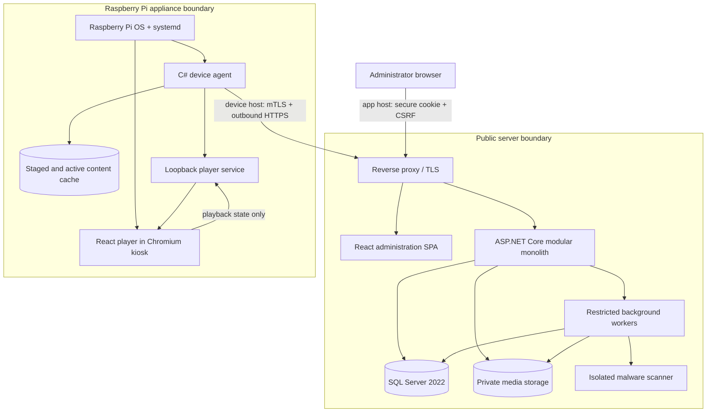
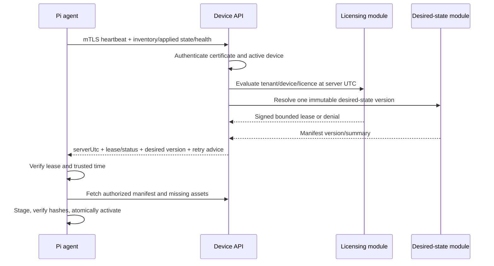

# Architecture Baseline

## 1. Architectural goals

The architecture is optimized for four properties:

1. strict tenant and authorization boundaries;
2. remote-device operation through outbound-only HTTPS;
3. offline playback that fails closed at a bounded authorization expiry; and
4. a minimal deployable shape that an internship project can implement, test, explain, and operate completely.

The approved baseline is a **modular monolith**, one SQL Server 2022 database, private object storage, and a separately deployed Pi agent/player. Modules communicate in-process through explicit application interfaces; they do not share mutable domain state casually.

## 2. System context



No browser discovers Pis on a LAN. No backend opens a connection into a customer network. A Pi reports its own inventory and consumes its own desired state.

## 3. Container view



### Proposed public surfaces

- `https://app.<domain>`: administration SPA and same-origin human API using secure cookies.
- `https://devices.<domain>`: bootstrap enrollment and mTLS device API.

Separate hosts allow the device surface to require client certificates without complicating normal browser sessions. Final domains and reverse-proxy technology are Goal 10 decisions.

## 4. Backend module boundaries

| Module | Responsibilities | Must not own |
|---|---|---|
| Identity | User accounts, invitations, MFA, sessions, recovery | Tenant resource authorization decisions without membership context |
| Tenancy | Tenants, memberships, roles, tenant lifecycle/context | Device credentials or content binaries |
| Devices | Enrollment, certificates, inventory, heartbeat, health | Licence truth or playlist authoring |
| Licensing | Licence lifecycle, effective state, signed leases, transfer | Trust client/player-declared entitlement |
| Content | Quarantine, validation/scan workflow, asset metadata/storage | Decide whether an arbitrary device may play content |
| Desired State | Groups, playlists, schedules, assignments, immutable manifest compilation | Authenticate users/devices |
| Synchronization | Device-scoped manifests/downloads, applied-state tracking | Modify published asset bytes |
| Audit | Append-oriented security/business events and queries | Store credentials or arbitrary request bodies |
| Operations | Health, metrics, background-job orchestration, notifications | Bypass tenant/security rules silently |

The API layer maps authenticated requests to application commands/queries. Domain rules remain independent from controllers, EF Core, storage SDKs, and React.

## 5. Human request path

```mermaid
sequenceDiagram
    actor U as Tenant user
    participant W as React admin
    participant A as ASP.NET Core API
    participant Z as Authorization policies
    participant D as SQL Server + RLS

    U->>W: Perform tenant action
    W->>A: HTTPS request + session cookie + CSRF token
    A->>A: Authenticate session and revocation state
    A->>Z: Resolve active membership and permission
    Z-->>A: Allowed tenant context
    A->>D: Begin transaction; SET LOCAL tenant context
    D->>D: Apply FORCE RLS policy
    D-->>A: Tenant-scoped result
    A-->>W: Problem Details or response + correlation ID
```

Tenant context is never set directly from a route/body value without checking the authenticated membership. Connection-pool reuse must not retain a prior tenant setting; context is applied transaction-locally and tested.

## 6. Enrollment and device identity path

```mermaid
sequenceDiagram
    actor TA as Tenant administrator
    participant API as Backend
    participant P as Pi agent
    participant CA as Protected certificate issuer

    TA->>API: Create short-lived one-use enrollment code
    API-->>TA: Show code once
    P->>P: Generate asymmetric key and CSR locally
    P->>API: TLS bootstrap + code + CSR + inventory
    API->>API: Rate limit; atomically validate/consume code
    API->>CA: Issue device-bound client certificate
    CA-->>API: Certificate chain (never private key)
    API-->>P: Certificate + trust/configuration metadata
    P->>API: First mTLS heartbeat
    API->>API: Validate chain, certificate record, device and tenant
```

The enrollment code is a bootstrap capability, not a long-term device credential. It is hashed at rest, expires quickly, is consumed atomically, and is never logged.

## 7. Heartbeat, licence, and desired-state path



The provisional heartbeat interval is 30 seconds with Online/Degraded/Offline derived from missed intervals. Values remain configurable and must be verified against expected fleet scale.

## 8. Offline authorization and trusted time

The backend creates an asymmetric signed lease with at least:

- schema/version and signing `kid`;
- tenant, device, certificate/credential binding, and licence identifiers;
- issue/not-before/not-after instants;
- desired-state/manifest identifier and relevant policy version; and
- unique token identifier to aid replay/audit handling.

`notAfter` is never later than the real licence end and never more than 24 hours after authenticated server time. The agent pins/configures trusted signing public keys and supports overlap during key rotation.

The agent maintains:

- last authenticated server UTC;
- monotonic elapsed time during a boot;
- last accepted lease/manifest identifiers; and
- a protected persistent checkpoint used to detect backward movement.

If a clock rollback, corrupt checkpoint, invalid signature/binding, or uncertain post-reboot time makes authorization ambiguous, playback fails closed. This is strong against accidental misconfiguration and remote replay but not against an operator with root/physical control; that limitation is explicit.

## 9. Content synchronization and local player boundary

The agent is the sole holder of the device credential and authorization decision. The local React player receives only:

- sanitized player state;
- the currently authorized local manifest;
- loopback URLs for currently authorized cached objects; and
- a narrow playback-status reporting operation.

It never receives the device private key, enrollment code, reusable backend token, object-storage credential, signing key, or unrestricted filesystem path.

Downloads use a staging directory. The agent verifies expected byte length and SHA-256 for every object and validates the complete manifest before an atomic pointer/directory swap. The prior active version is retained long enough for safe rollback and removed only under a bounded cache policy.

## 10. Deployment and trust boundaries

| Boundary | Higher-trust side | Lower/untrusted input |
|---|---|---|
| Internet to admin host | Reverse proxy/API | Browser requests and uploaded media |
| Internet to device host | mTLS device API | Enrollment attempts and device-reported inventory |
| API to SQL Server | Parameterized EF/data layer with tenant `SESSION_CONTEXT` | Domain/query parameters |
| API/worker to object storage | Private service identity | Uploaded bytes and metadata |
| Worker to media scanner/parser | Isolated bounded process | Potentially malicious files |
| Agent to local player | Agent authorization gate | Browser/player state |
| Pi filesystem/OS | Managed service accounts | Cached media and local physical environment |
| Application to signing/CA keys | Narrow signing/issuance adapter | Application signing requests |

## 11. Availability and failure behavior

| Failure | Required safe behavior |
|---|---|
| Backend/network unavailable | Continue cached playback only under a valid bounded lease; retry with jitter |
| Licence uncertain/invalid | Show **Not licensed**; do not expose cached content |
| Object storage unavailable | Preserve last complete active version; report synchronization failure |
| Scanner unavailable | Keep uploads quarantined; do not publish |
| Partial/corrupt download | Reject staged version; retain prior valid version |
| Database unavailable | Fail readiness; do not fabricate authorization |
| Agent crash | `systemd` bounded restart; player reaches safe local state |
| Chromium crash | kiosk restart without exposing desktop/admin controls |
| Disk nearly full | Alert, clean only safe inactive versions, preserve active state |
| Signing-key rotation | Accept documented overlap; reject unknown/retired keys |

## 12. Technology constraints

- .NET 10 LTS target with current supported patches.
- React 19.2 stable line and Vite 8 stable line, exact versions pinned at scaffold time.
- SQL Server 2022 runtime; integration tests run against the same major version.
- Raspberry Pi publishes target `linux-arm64` and must be exercised on actual Pi 4/5 hardware.
- No framework or infrastructure component may silently become a security authority outside these boundaries.
