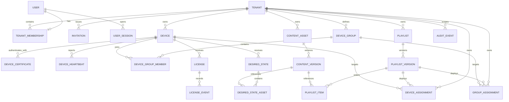

# Logical Data Model

## 1. Modeling conventions

- Primary identifiers use application-generated UUIDs; UUIDv7 is preferred where supported and tested.
- Authorization/audit timestamps are UTC and stored as SQL Server `datetimeoffset` values.
- Tenant-owned tables contain a non-null `tenant_id` even where it could be inferred through a parent relation. This supports simple, auditable RLS predicates and composite integrity constraints.
- Foreign keys between tenant-owned tables include or otherwise enforce the same tenant.
- Mutable aggregates use optimistic concurrency tokens where conflicting administrative edits matter.
- Published manifests and asset versions are immutable.
- Secrets, private keys, raw invitation/enrollment/reset tokens, MFA recovery codes, and licence-signing private keys are not ordinary domain columns.

## 2. High-level relationship model



## 3. Identity and tenancy entities

### `user`

Global ASP.NET Core Identity account. Core fields include normalized verified email, password hash metadata, security stamp, account state, MFA state, and created/updated timestamps. Tenant roles do not live directly on this record.

### `tenant`

Customer organization with name, stable slug, lifecycle state, default IANA timezone, locale, retention/configuration fields, and concurrency metadata.

### `tenant_membership`

Tenant/user membership with role (`TenantAdmin`, `ContentManager`, `Viewer`), state, inviter, accepted timestamp, and concurrency metadata. It is unique on `(tenant_id, user_id)` and, for v1 customer accounts, on active `user_id` so one customer user cannot silently span tenants.

### `invitation`

Tenant, normalized target email, intended role, expiry, consumed/revoked timestamps, creator, and **hash** of the one-use token. Raw token is returned/sent once only.

### `user_session`

Opaque session identifier/hash, user, creation/last-seen/idle/absolute expiry, revoked timestamp/reason, security-stamp/version metadata, and safe client metadata. Enables server-side revocation without storing browser cookie contents.

## 4. Device entities

### `device`

Tenant-owned enrolled Pi aggregate:

- administrator display name;
- normalized reported Pi serial and conflict/review state;
- hostname, OS, architecture, agent/player versions;
- lifecycle state (`PendingEnrollment`, `Active`, `Suspended`, `Retired`);
- last heartbeat/trusted server interaction;
- desired/applied state versions and playback health;
- disk capacity/free-space summary; and
- concurrency/audit timestamps.

The serial is inventory and a licence-association signal, not the authenticating key. A partial unique rule prevents two normal active devices from silently claiming the same serial while preserving conflict records.

### `device_network_interface`

Latest normalized interface snapshot: device, interface name, MAC, local addresses, observed timestamp. Historical storage is bounded to operational need. The public source address belongs to heartbeat/server observation, not this trusted inventory claim.

### `enrollment_token`

Tenant, optional expected device/serial constraint, token hash, expiry, consumed/revoked timestamps, creator, and attempt metadata. Atomic single consumption is a database invariant.

### `device_certificate`

Device, certificate fingerprint/serial, public-key and issuer metadata, not-before/not-after, state, issued/rotated/revoked timestamps and reason. No device private key is stored.

### `device_heartbeat`

Append/bounded operational record containing received server time, server-observed public address, inventory/version summary, applied manifest, player health, disk state, correlation ID, and result. High-frequency retention/aggregation must be configurable.

## 5. Licence entities

### `license`

Tenant, device, start UTC, exclusive end UTC, explicit control state, creation/renewal metadata, transfer lineage, latest issued-lease expiry relevant to transfer, and concurrency token. Database checks require `end > start` and same-tenant device ownership.

### `license_event`

Append-only event for create, activate observation, renew, suspend, reactivate, revoke, expire observation, or transfer. Records actor, reason, prior/new relevant state, timestamps, and linked replacement/previous device where applicable.

Effective state is computed by domain logic from interval plus explicit events; a client-provided status string is never authoritative.

## 6. Content and desired-state entities

### `content_asset`

Stable tenant-owned logical asset with title, description, media category, lifecycle, creator, and archive state.

### `content_version`

Immutable version containing private storage key, byte length, SHA-256, detected MIME/signature, playback metadata, original display filename, quarantine/scan/approval results, creator, and timestamps. Storage keys are tenant-namespaced random identifiers.

### `playlist` and `playlist_version`

The logical playlist is editable through creation of immutable versions. A version stores name/description snapshot, publication state, creator, and timestamps.

### `playlist_item`

Playlist version, strict order, content version, image/text duration, video loop/playback parameters, and optional safe presentation metadata. Unique order within a playlist version.

### `device_group` and `device_group_member`

Tenant-owned grouping. Membership references must share tenant. Group changes trigger recompilation of affected device desired state rather than mutating an already-issued manifest.

### `device_assignment` and `group_assignment`

Separate tenant-owned tables target either one device or one group and reference an immutable playlist version. Both store enabled state, priority, optional effective UTC bounds, tenant presentation timezone, publisher metadata, and an optimistic concurrency token. This accepted design replaces a polymorphic target column so SQL Server can enforce composite same-tenant foreign keys for both target kinds. Recurring schedules remain outside v1.

### `desired_state`

Immutable server-compiled manifest header for one device: tenant/device, monotonic version, source assignment snapshot, effective schedule metadata, manifest SHA-256, created/published timestamp, and supersession pointer.

### `desired_state_asset`

Ordered flattened asset reference including content version, byte length/hash, playback parameters, and authorization-relevant metadata. The serialized/signed manifest must be reproducible from this state.

## 7. Audit and operations entities

### `audit_event`

Append-oriented event containing tenant when applicable, actor type/id, action, target type/id, UTC timestamp, outcome, reason code, correlation ID, safe source metadata, and a constrained JSON details object. Secrets and arbitrary request bodies are prohibited.

### `outbox_message`

Transactional outbox for invitations, alerts, and other external side effects. Contains type, tenant, aggregate reference, safe payload, occurrence/attempt timestamps, status, and last safe error. Prevents committing a domain change while losing its required notification intent.

### `system_key_metadata`

Public metadata only for accepted licence-signing keys (`kid`, algorithm, public key/certificate, activation/retirement). Private signing and CA key material resides in the chosen secret/key service.

## 8. RLS baseline

The tenant row and every tenant-owned table use policies equivalent to:

```sql
ALTER TABLE app.devices ENABLE ROW LEVEL SECURITY;
ALTER TABLE app.devices FORCE ROW LEVEL SECURITY;

CREATE POLICY devices_tenant_isolation ON app.devices
USING (tenant_id = NULLIF(current_setting('app.tenant_id', true), '')::uuid)
WITH CHECK (tenant_id = NULLIF(current_setting('app.tenant_id', true), '')::uuid);
```

Implementation rules:

1. absence or invalidity of `app.tenant_id` denies access;
2. tenant context is set with `SET LOCAL` inside an explicit transaction;
3. the runtime role does not own protected tables and cannot bypass RLS;
4. migrations use a separate principal;
5. platform-wide operations use narrowly reviewed paths/roles, never a hidden universal tenant value;
6. background jobs set the tenant explicitly for each unit of work; and
7. pooled-connection, raw-SQL, navigation, foreign-key, unique-constraint, backup, and migration cases receive integration tests.

## 9. Deletion and retention baseline

- Accounts/memberships may be deactivated before deletion to preserve accountability.
- Devices are retired; certificate and licence history remains auditable.
- Licences and licence events are not hard-deleted through normal tenant operations.
- Published versions are superseded/archived rather than mutated.
- Rejected quarantine objects are deleted after a short configured retention while retaining a safe rejection audit.
- Heartbeat detail is aggregated/expired under an operational retention policy.
- Audit retention, personal-data erasure, and backup expiry require the legal/organization policy in `OPEN_DECISIONS.md`.

## 10. Migration acceptance checks

Every schema migration must prove:

- upgrade from the previous supported schema;
- required constraints and indexes exist;
- RLS remains enabled and forced on every tenant table;
- runtime and migration role grants remain least-privileged;
- representative allowed and denied tenant operations behave correctly; and
- downgrade/forward-recovery procedure is documented when automatic rollback is unsafe.
